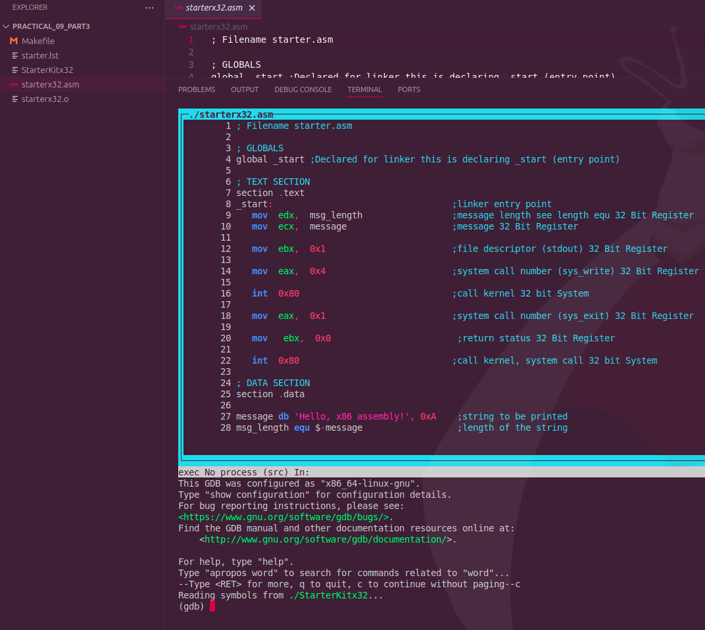
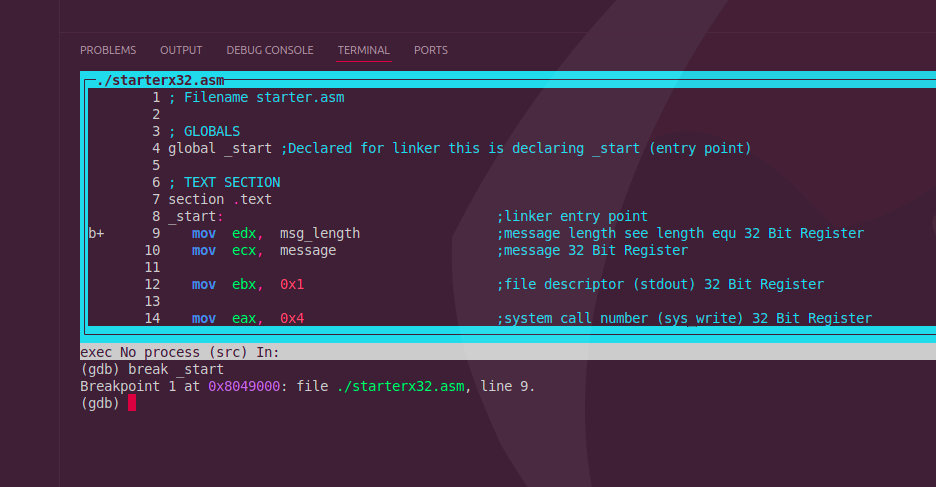
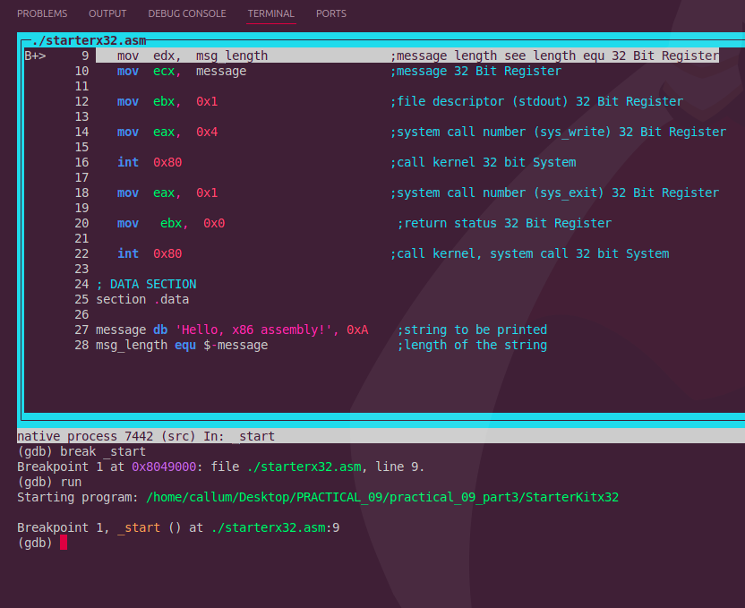
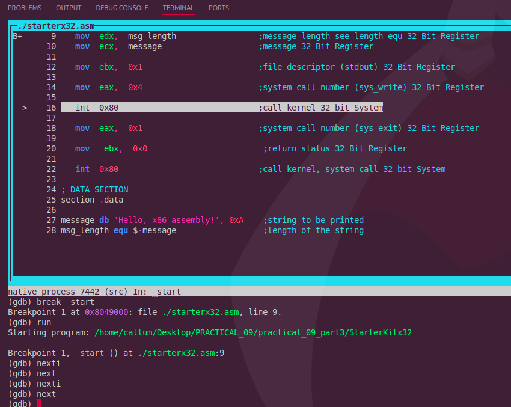
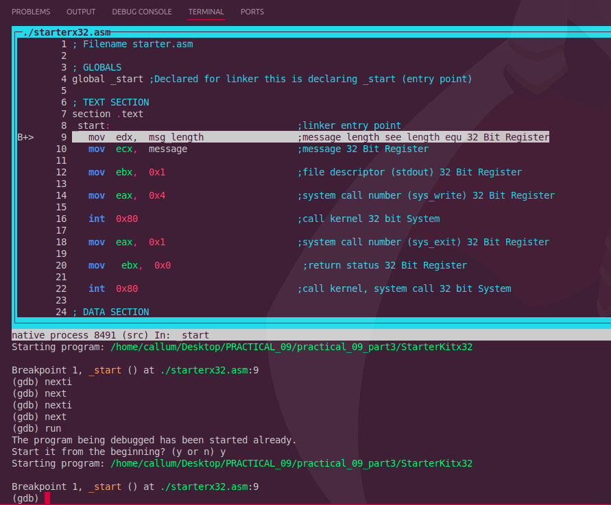
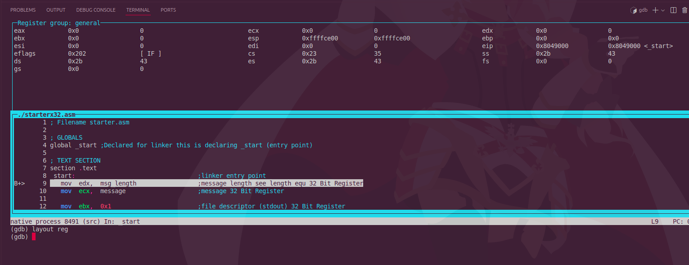
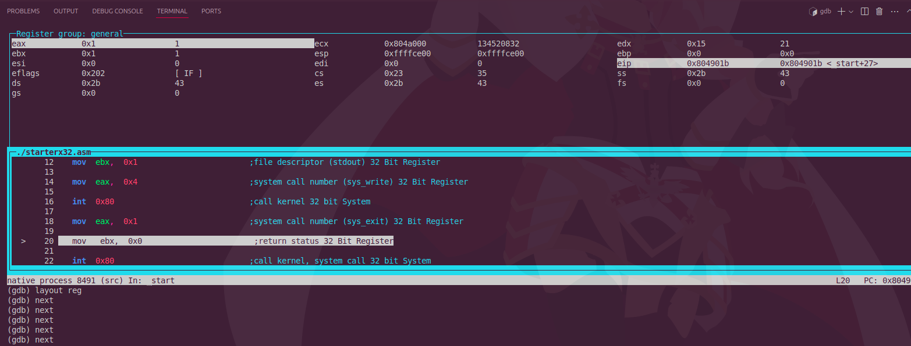
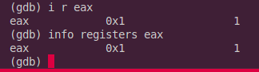
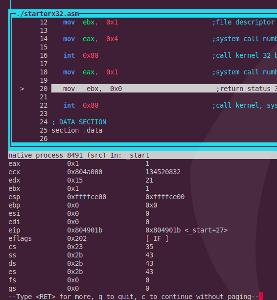

All images viewable here;

Run make file as normal.
Intsall gdb with : sudo apt install gdb

in terminal, run: gdb ./Starterkitx32 -tui

-tui is the text user interface. Runs the Gui.

/StarterKitx32 is the binary or compiled program to debug with gdb.

This opens graphic interface in GBD as follows:

Next, add a breakpoint with break_start as follows:

(gdb) break _start

Image below:

Next, Run binary with: run

Next, step through with nexti AND next commands:

Next moves line by line through C source code, while nexti is through assembly code through one cpu instruction at a time.

Run the StarterKitx32 with the run command as follows:

As i already ran it, it will ask me to rerun again, select yes. 

Layout Registers:

Type command: layout reg

Then move with next to see registers change:

Examine registers with following commands:

info registers eax

i r eax

As seen below:

info all-registers

Finally, to quit type: quit
If prompted to kill processes, type y